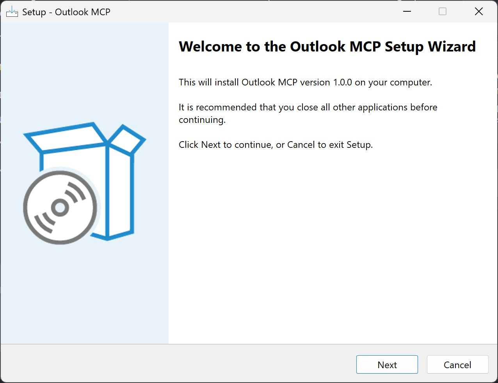
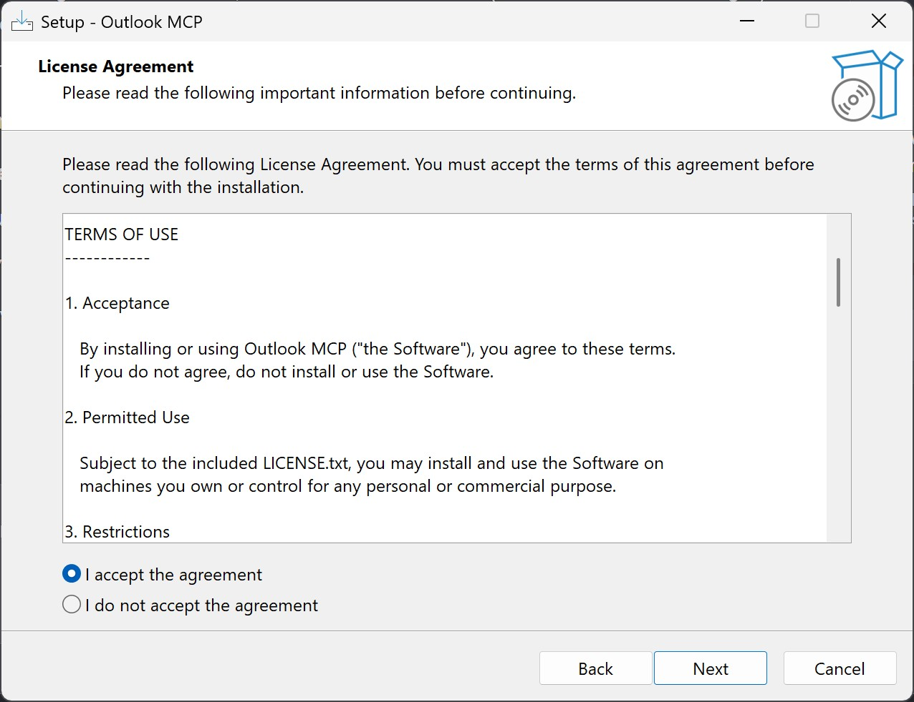
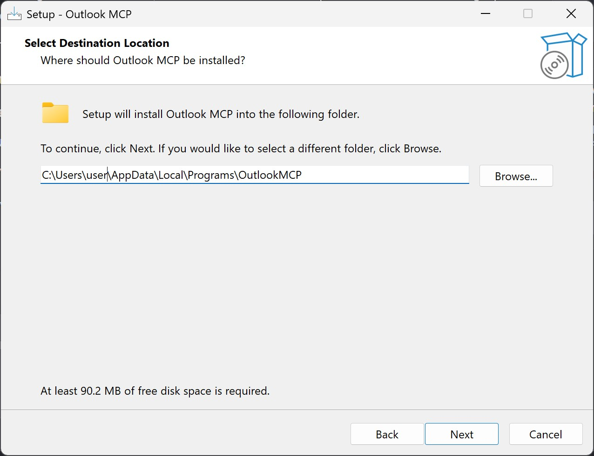
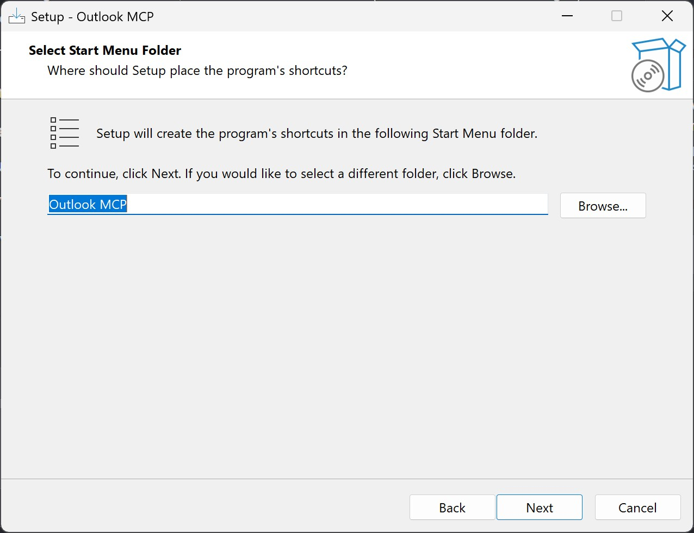
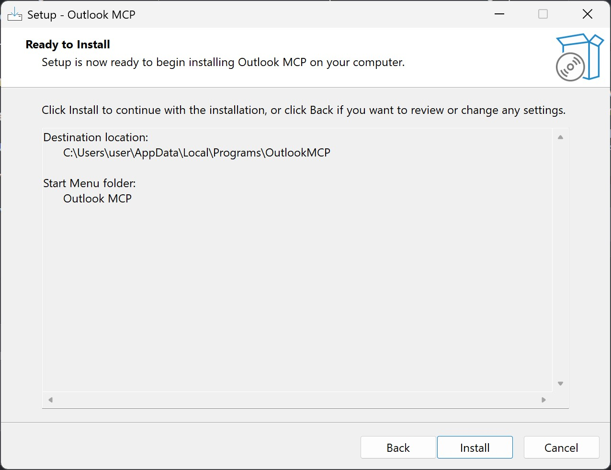
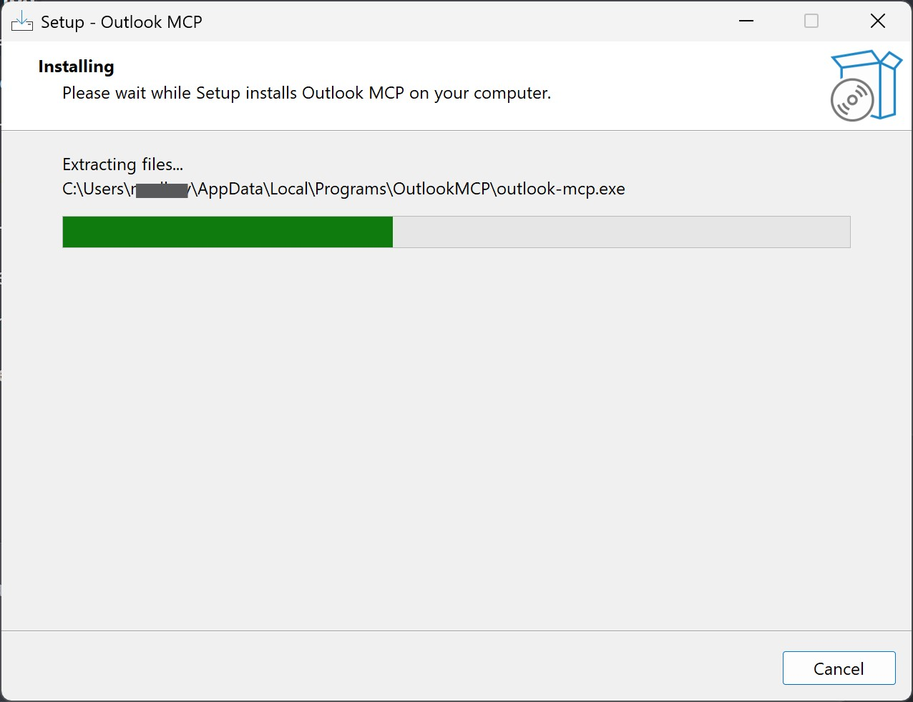
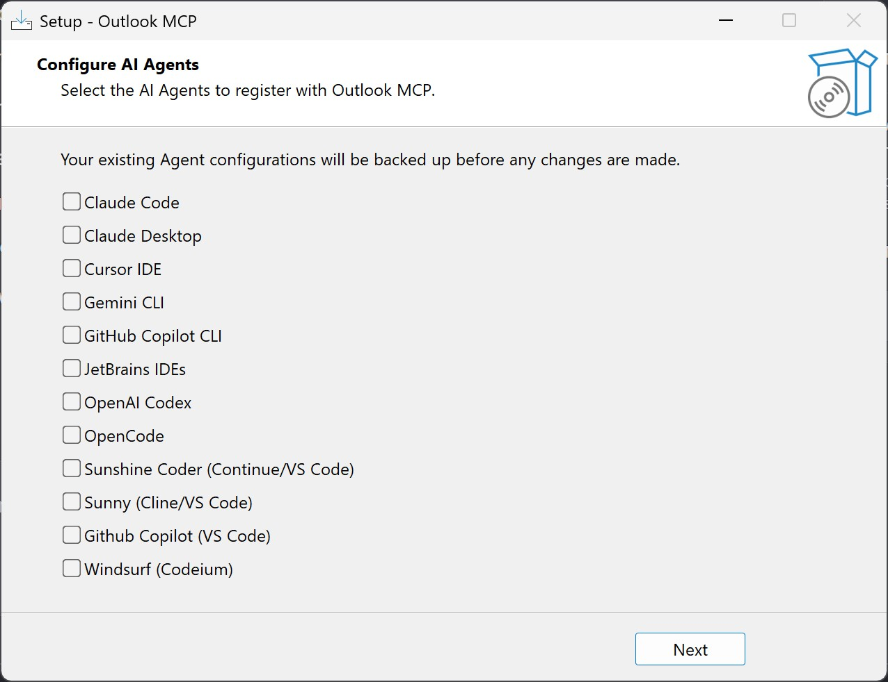
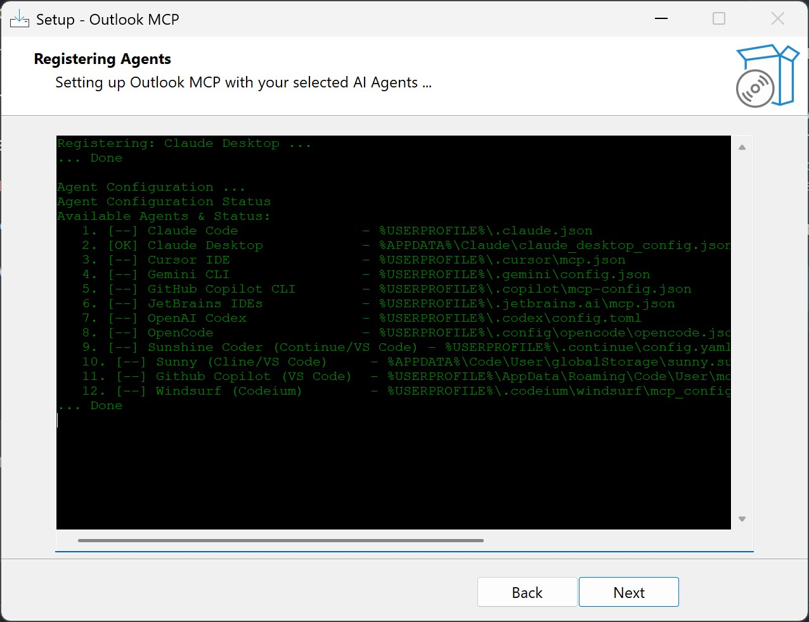
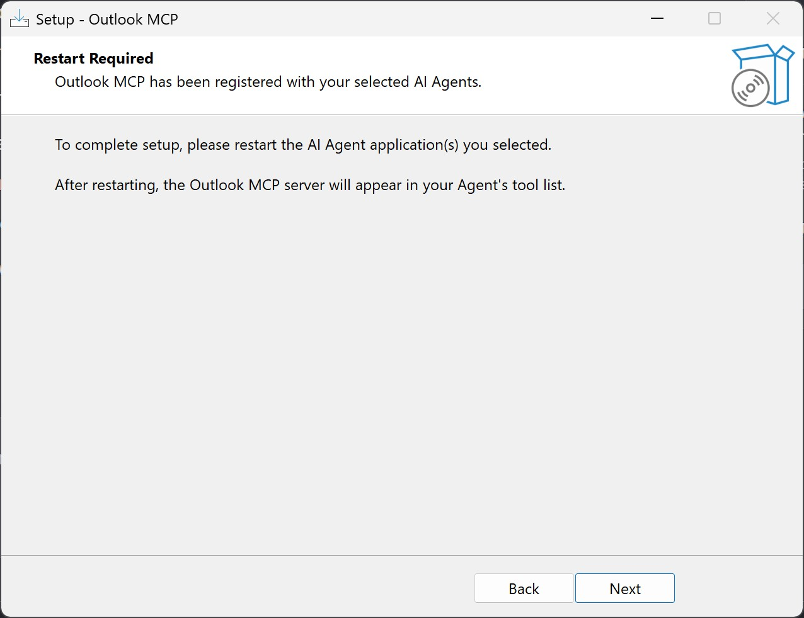
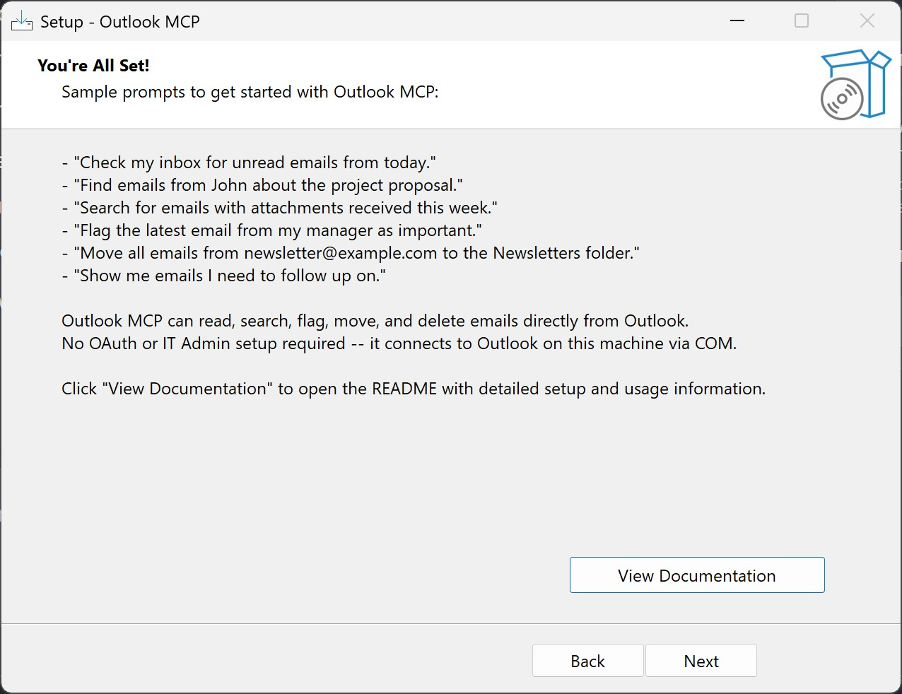

# Outlook MCP Setup Guide for Windows

**Outlook MCP** gives AI agents like Claude and GitHub Copilot direct access to your Microsoft Outlook emails, tasks, calendar events, and folders. No IT admin approval needed—it runs entirely on your computer using your existing Outlook installation.

## What You'll Get

After installation, you can use AI agents to:

**Email Management:**

- **Check emails** from your Inbox (filtered by time period)
- **Search emails** across your mailbox
- **Read full emails** with attachments
- **Flag, mark as read, and organize** emails
- **Move and delete** emails
- **List folders and mailboxes** you have access to

**Task Management:**

- **Create, update, and manage** tasks with priorities and due dates
- **List and filter** tasks by status and date range
- **Mark tasks complete** and delete tasks
- **Organize your to-do list** with Outlook Tasks

**Calendar and Meeting Management:**

- **View calendar events** with full details and attendees
- **Schedule events** and create calendar entries
- **Search and list** events by date range
- **Manage recurring events** (create, update, delete series)
- **Check availability** and detect scheduling conflicts
- **Send meeting invites** to attendees
- **Respond to meeting requests** (accept, decline, tentatively accept)

**Folder Organization:**

- **Create, rename, and move** folders for better email organization
- **Manage folder structure** across your mailboxes
- **Soft-delete folders** to maintain a clean inbox

## Prerequisites

Before you start, make sure you have:

- **Windows 10 or later** (including Windows 11)
- **Microsoft Outlook installed** on your computer (Outlook for Microsoft 365 or standalone)
- A compatible AI agent like:
  - Claude Code
  - Claude Desktop
  - GitHub Copilot
  - Cursor IDE
  - Or other supported agents

## Installation Steps

### Step 1: Download the Installer

Visit the [Releases page](https://github.com/madharjan/releases/releases/) and download the latest `OutlookMCP-Setup.exe`.

### Step 2: Run the Installer

Double-click `OutlookMCP-Setup.exe` to start the installation wizard.



**The Welcome screen appears.** Click "Next" to continue.

### Step 3: Accept the License



**Review the license agreement.** Check the box "I accept the agreement" and click "Next".

### Step 4: Choose Installation Location



**Select where to install Outlook MCP.** The default location (`C:\Users\[YourUsername]\AppData\Local\Programs\OutlookMCP`) is recommended. Click "Next".

### Step 5: Choose Start Menu Folder



**Choose where the Start Menu shortcut appears.** The default "OutlookMCP" folder is fine. Click "Next".

### Step 6: Review Installation Settings



**Review your settings.** Everything looks correct? Click "Install" to begin.

### Step 7: Installation in Progress



**Wait while Outlook MCP installs.** This typically takes 10-30 seconds.

### Step 8: Configure Your AI Agent



**Choose which AI agents you want to use Outlook MCP.** You can set up multiple agents:

- **Claude Code** – Use Outlook in VS Code or the Claude Code CLI
- **Claude Desktop** – Use Outlook in the Claude Desktop app
- **GitHub Copilot** – Use Outlook in VS Code with Copilot
- **Cursor IDE** – Use Outlook in Cursor IDE
- **Other agents** – JetBrains IDEs, Continue, Cline, Windsurf, and more

Select the agents you use, then click "Next" to auto-configure them.

### Step 9: Registering AI Agents



**The installer is saving configurations.** This registers Outlook MCP with your chosen agents so they can access it. Click "Next" when complete.

### Step 10: AI Agent Restart Required



**Your AI Agent needs to be restarted** to finalize agent registration. Click "Next" to proceed with the restart.

### Step 11: Setup Complete



**Installation is complete!** Once your AI Agent is restarted. You can now use Outlook MCP with your configured AI agents.

## Next: Learn How to Use It

Ready to use Outlook MCP? See the **[User Guide](./user-guide.md)** for:

- How to ask Claude and other agents about your emails, tasks, calendar, and folders
- Available tools and capabilities
- Tips and examples for each agent

## Reconfiguring After Installation

If you want to add or remove agents after installation:

1. **Open Command Prompt** (Win+R, type `cmd`, press Enter)
2. **Run configuration commands:**

```cmd
outlook-mcp.exe --agent-interactive
```

A menu appears with these options:

```txt
'add 1-12' to add Agent or 'add all' to configure all Agents
'remove 1-12' to remove Agent or 'remove all' to remove from all Agents
'backup all' to backup all configurations
'restore all' to restore from backup
'status' to show agent status
'quit' to exit
```

### Common Configuration Commands

```cmd
# Check which agents are already configured
outlook-mcp.exe --agent-status

# Configure Claude Code
outlook-mcp.exe --agent-add claude_code

# Configure all supported agents
outlook-mcp.exe --agent-interactive
(then type: add all)

# Remove from a specific agent
outlook-mcp.exe --agent-remove claude_desktop

# See all available commands
outlook-mcp.exe --help
```

## Troubleshooting

### "Outlook is not installed"

Outlook MCP requires Microsoft Outlook. Ensure Outlook is installed and has been opened at least once.

### "AI Agent configuration failed"

Try reconfiguring using:

```cmd
outlook-mcp.exe --agent-interactive
```

### "Claude can't access emails"

1. Check that Outlook is running
2. Restart your AI agent (close and reopen Claude Desktop, VS Code, etc.)
3. Verify configuration with: `outlook-mcp.exe --agent-status`

### Need more help?

Visit the [GitHub repository](https://github.com/madharjan/releases) for detailed documentation, issues, and support.

## Next Steps

1. **Restart your AI Agent** (The installer cannot do this for you)
2. **Open your AI agent** (Claude Desktop, Claude Code, or Copilot)
3. **Try asking about your emails, tasks, and calendar**: _"What emails did I get in the last hour? Do I have any meetings today?"_

That's it! You're ready to use Outlook MCP.

## What's New

Check the [Changelog](./changelogs.md) for version history and latest features.

## Learn More

- **Full Details & Support:** [madharjan/releases on GitHub](https://github.com/madharjan/releases)
- **Latest Releases:** [Download or view release notes](https://github.com/madharjan/releases/releases/)
